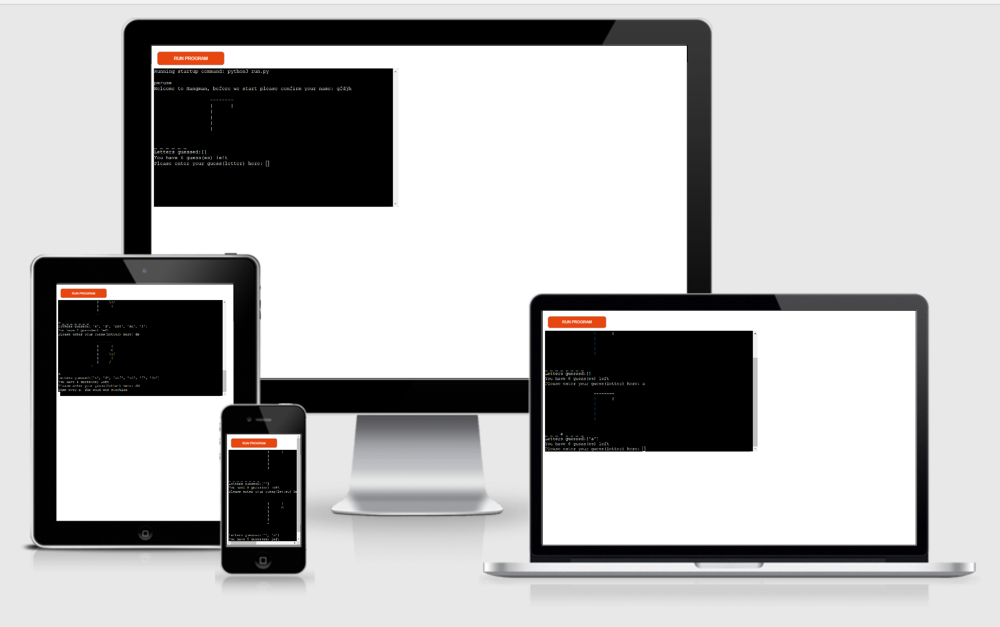
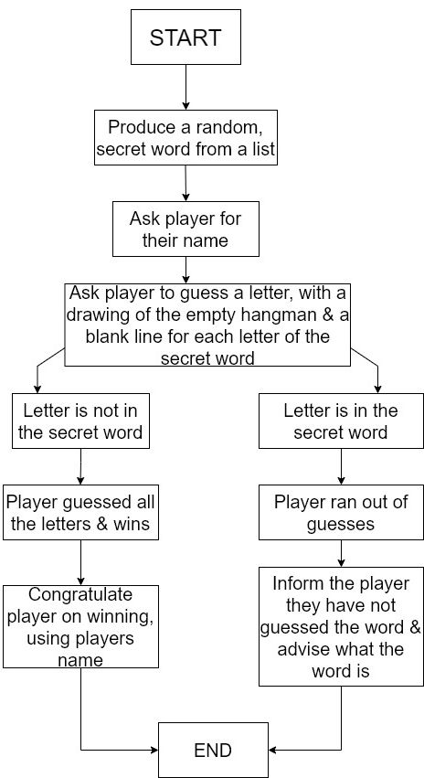

### Hangman 
 
Hangman game implimented in the command line & deployed using Heroku. 
Selects a random word from a list of over 100 words ranging in difficulty. 

### Live Prototype Demo
[Live link here](https://hangman-new.herokuapp.com/)

### Flow Chart
 

### Validator Testing
Python checker.
- http://pep8online.com/

## Python Libraries
random
- Used to randomise the secret words

list-of-words
- A file containing over 100 words to be use to pick a random secret word

### Personal Testing
- I consistently tested every new code added to the game via the command terminal & on the deployment page for bugs & errors.
- I wanted the hangman in every guess to signify each stage but it was only appearing on the first guess. I did not want to
have to add print beside every line of every image & split it into various variable to be called after each wrong guess. 
I managed to resolve this by trial & error, by placing a hangman-image command(that calculates the current guesses no) at the beginning of the loop.
- I added a list of the previous errors to be viewed with every request for a new guess.
- Deployment error with not finding run.py- Resolved by removing creds.json after several tests at workarounds & discussing various options with the Tutor team.

### User Stories 
- As a User I want to be able to see the hangman at after each guess
- As a User I want to be able to see which letters I have already guessed so I can choose a new one
- As a User I want to know exactly how much guesses I have left
- As a User I want to have a user friendly experience, when I win my name is called out in celebration
- As a User I want to test myself against a variety of random difficult words & get the answer in as few guesses as possible
- As a User I want the ability to know when input is required

### Deployment
The site was deployed using Heroku using the folowing guidelines:
- Ensure that the project has the correct content within the requirements.txt document by running the following commands in the IDE terminal: -pip freeze > requirements.txt
- Check requirements folder to confirm. Now select the option for New App, (You may have upto 5 applications live with a free heroku account)
- Insert project a name, and choose your location
- Once successful the project dashboard will display
- * As this project does not make any API calls there is no requirement to add an authorisation key
- Add Buildpacks required, both Python and Nodejs (to be added in that order!)
- Select the deployment tab and choose Github at the bottom of the deploy page
- Search for your repository, and select the correct match
- Deploying to Heroku can be done automatically & manually, I enabled automatic builds when code commited & manually built the application
- See live project on Heroku at the top of the page under Live Prototype Demo.

### Ackowledgments
Thank you to my Mentor Felipe Souza Alarco for all of our insightful meetings, particularly the one just before submission.
Thank you to Kasia who is always there to inspire, advise & support whenever needed.
I watched various different helpful tutorials on YouTube on how to build a Hangman game from FreeCodeCamp to CBT Nuggets but I attempted to build it my own way.
Thank you to the excellent Customer Support & Tutor teams. Thank you to all the slackers on slack & the in-it-together calls, particularly Daisy_Mentor for her help & assistance.